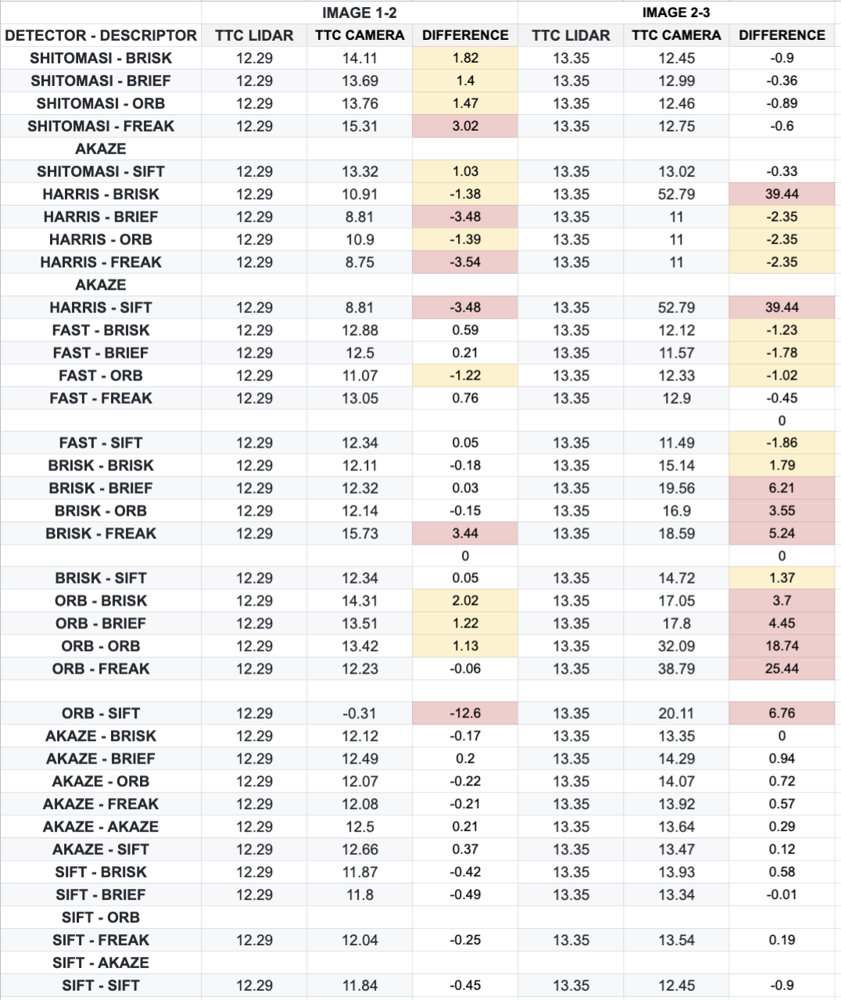

# SFND 3D Object Tracking

Welcome to the final project of the camera course. By completing all the lessons, you now have a solid understanding of keypoint detectors, descriptors, and methods to match them between successive images. Also, you know how to detect objects in an image using the YOLO deep-learning framework. And finally, you know how to associate regions in a camera image with Lidar points in 3D space. Let's take a look at our program schematic to see what we already have accomplished and what's still missing.


In this final project, you will implement the missing parts in the schematic. To do this, you will complete four major tasks: 
1. First, you will develop a way to match 3D objects over time by using keypoint correspondences. 
2. Second, you will compute the TTC based on Lidar measurements. 
3. You will then proceed to do the same using the camera, which requires to first associate keypoint matches to regions of interest and then to compute the TTC based on those matches. 
4. And lastly, you will conduct various tests with the framework. Your goal is to identify the most suitable detector/descriptor combination for TTC estimation and also to search for problems that can lead to faulty measurements by the camera or Lidar sensor. In the last course of this Nanodegree, you will learn about the Kalman filter, which is a great way to combine the two independent TTC measurements into an improved version which is much more reliable than a single sensor alone can be. But before we think about such things, let us focus on your final project in the camera course. 

## WRITEUP
**1. MATCH BOUNDING BOXES**<p>
The Match Bounding Boxes function does 3 things:
1. Loop through all matches provided by the match descriptor/detector function
2. Build a match matrix of keypoint/bounding box.
3. Assign to each bounding box in the current frame the bounding box in the previous frame that had the greatest number of keypoints.

I am wondering if The Hungarian Algorithm would work better than a simple i,j table association?

```C++
void matchBoundingBoxes(std::vector<cv::DMatch> &matches, std::map<int, int> &bbBestMatches, DataFrame &prevFrame, DataFrame &currFrame)
{
    //Initialize a match matrix with zeros
    cv::Mat match_matrix= cv::Mat::zeros(prevFrame.boundingBoxes.size(), currFrame.boundingBoxes.size(), CV_32S);

    // 1. Loop through all keypoint matches
    for (auto it = matches.begin(); it!= matches.end(); ++it){
        // 2. Check for enclosing Bounding Boxes
        cv::KeyPoint current_keypoint = currFrame.keypoints[it->trainIdx];
        cv::KeyPoint previous_keypoint = prevFrame.keypoints[it->queryIdx];
        for (int i =0; i< prevFrame.boundingBoxes.size(); i++)
        {
            for (int j=0; j<currFrame.boundingBoxes.size(); j++)
            {
                if (currFrame.boundingBoxes[j].roi.contains(current_keypoint.pt) && (prevFrame.boundingBoxes[i].roi.contains(current_keypoint.pt))){
                    match_matrix.at<int>(i,j)++; // Increment the number of keypoints in the BB relation
                } 
            }
        }
    }
    // 3. Count occurences in the match matrix and select the more keypoints
    int best_value, best_id;
    for (size_t i=0; i<match_matrix.rows;++i)
    {
        best_value = 0;
        best_id = -1;
        for (size_t j=0; j<match_matrix.cols; ++j)
        {
            if (match_matrix.at<int>(i,j) > best_value && match_matrix.at<int>(i,j) >0)
            {
                best_value = match_matrix.at<int>(i,j);
                best_id = j;
            }
        }
        if (best_id != -1)
        {
            bbBestMatches.emplace(i, best_id);
        }
    }

}
```
**2. LIDAR TTC**<p>
Here, we are computing the TTC between 2 LiDAR points: current and previous.
The only thing that we do is that we average all keypoints for the previous bounding box and all those for the current and create an average keypoint.
This way, we can be more robust to outliers.
```C++
void computeTTCLidar(std::vector<LidarPoint> &lidarPointsPrev,
                     std::vector<LidarPoint> &lidarPointsCurr, double frameRate, double &TTC)
{
    //To avoid the case of a sudden outlier ruining everything, we'll take the average of the LiDAR point
    double dT = 1/ frameRate;
    double avgXPrev = 0, avgXCurr = 0;
    // Provided code in the classroom works for 2 points
    for (auto it = lidarPointsPrev.begin(); it!= lidarPointsPrev.end(); ++it)
    {
        //minXPrev = minXPrev > it->x ? it->x : minXPrev; // Provided code in the classroom works for 2 points
        avgXPrev += it->x;
    }
    avgXPrev = avgXPrev / lidarPointsPrev.size();
    for (auto it = lidarPointsCurr.begin(); it!= lidarPointsCurr.end(); ++it)
    {
        //minXCurr = minXCurr > it->x ? it->x : minXCurr;// Provided code in the classroom works for 2 points
        avgXCurr += it->x;
    }
    avgXCurr = avgXCurr / lidarPointsCurr.size();
    TTC = avgXCurr *dT / (avgXPrev - avgXCurr);
}
```
 
**3. CAMERA TTC - CLUSTERING**<p>
In this part, we associate the keypoints to bounding boxes.
If a keypoint is withing a bounding box, we associate it.
However, the keypoint must be closed to the mean of all the other keypoints in the bounding box.
We determine a mean distance as a threshold.

```C++
void clusterKptMatchesWithROI(BoundingBox &boundingBox, std::vector<cv::KeyPoint> &kptsPrev, std::vector<cv::KeyPoint> &kptsCurr, std::vector<cv::DMatch> &kptMatches)
{
    double mean_distance = 0.0;
    int matched_pts = 0;
    for (cv::DMatch &kptMatch : kptMatches)
    {
        if (boundingBox.roi.contains(kptsCurr[kptMatch.trainIdx].pt)){
            mean_distance+=kptMatch.distance;
            matched_pts++;
        }
    }
    mean_distance = mean_distance / matched_pts;
    for (cv::DMatch &kptMatch : kptMatches)
    {
        if (boundingBox.roi.contains(kptsCurr[kptMatch.trainIdx].pt) && kptMatch.distance < mean_distance)
        {
            boundingBox.kptMatches.push_back(kptMatch);
        }
    }
}
```
**4. CAMERA TTC - TCC CALCULATION**<p>
Once TTC is ready to be calculated, we calculate euclidean distances and Time To Collision.
Instead of the mean distance ratio, we use the median. It gives more robust results.

```C++
void computeTTCCamera(std::vector<cv::KeyPoint> &kptsPrev, std::vector<cv::KeyPoint> &kptsCurr, 
                      std::vector<cv::DMatch> kptMatches, double frameRate, double &TTC, cv::Mat *visImg)
{
    vector<double> distRatios;
    for (auto it1 = kptMatches.begin(); it1!= kptMatches.end() -1; ++it1){
        cv::KeyPoint kpOuterCurr = kptsCurr.at(it1->trainIdx);
        cv::KeyPoint kpOuterPrev = kptsPrev.at(it1->queryIdx);
        for (auto it2 = kptMatches.begin()+1; it2 != kptMatches.end(); ++it2)
        {
            double minDist = 100;
            cv::KeyPoint kpInnerCurr = kptsCurr.at(it2->trainIdx);
            cv::KeyPoint kpInnerPrev = kptsPrev.at(it2->queryIdx);
            double distCurr = cv::norm(kpOuterCurr.pt - kpInnerCurr.pt);
            double distPrev = cv::norm(kpOuterPrev.pt - kpInnerPrev.pt);
            if (distPrev >std::numeric_limits<double>::epsilon() && distCurr>= minDist){
                double distRatio = distCurr / distPrev;
                distRatios.push_back(distRatio);
            }
        }
    }
    if (distRatios.size()==0){
        TTC = NAN;
        return;
    }
    //double meanDistRatio = std::accumulate(distRatios.begin(), distRatios.end(), 0.0)/distRatios.size();
    // - Use Median Distance Ratio instead of Mean
    std::sort(distRatios.begin(), distRatios.end());
    long medIndex = floor(distRatios.size()/2.0);
    double medDistRatio = distRatios.size() %2 ==0 ? (distRatios[medIndex - 1] + distRatios[medIndex])/2.0 : distRatios[medIndex];
    double dT = 1/frameRate;
    TTC = -dT / (1 - medDistRatio);
}
```
**5. LIDAR ANALYSIS**<p>
I didn't find examples where LiDAR seemed off. Both precision & Accuracy were pretty good.
Around frame 7, both LiDAR and Camera seemed to diverge.

**6. CAMERA ANALYSIS**<p>
In this picture, you can see that I computer for 4 consecutive images the Time To Collision provided by LiDAR and Camera.
Based on these results, we can see that HARRIS, ORB, and BRISK are the least performant in term of detection & TTC estimation.
The best were SHITOMASI, AKAZE and SIFT.



## Dependencies for Running Locally
* cmake >= 2.8
  * All OSes: [click here for installation instructions](https://cmake.org/install/)
* make >= 4.1 (Linux, Mac), 3.81 (Windows)
  * Linux: make is installed by default on most Linux distros
  * Mac: [install Xcode command line tools to get make](https://developer.apple.com/xcode/features/)
  * Windows: [Click here for installation instructions](http://gnuwin32.sourceforge.net/packages/make.htm)
* OpenCV >= 4.1
  * This must be compiled from source using the `-D OPENCV_ENABLE_NONFREE=ON` cmake flag for testing the SIFT and SURF detectors.
  * The OpenCV 4.1.0 source code can be found [here](https://github.com/opencv/opencv/tree/4.1.0)
* gcc/g++ >= 5.4
  * Linux: gcc / g++ is installed by default on most Linux distros
  * Mac: same deal as make - [install Xcode command line tools](https://developer.apple.com/xcode/features/)
  * Windows: recommend using [MinGW](http://www.mingw.org/)

## Basic Build Instructions

1. Clone this repo.
2. Make a build directory in the top level project directory: `mkdir build && cd build`
3. Compile: `cmake .. && make`
4. Run it: `./3D_object_tracking`.
